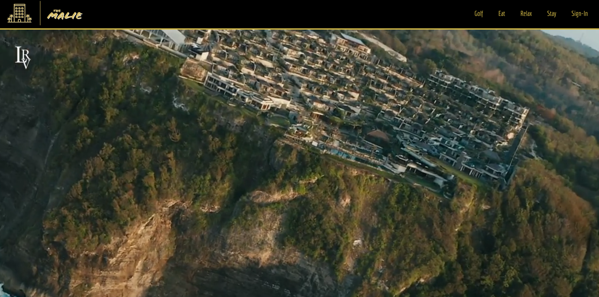

# Fancy Hotel!

## Description:

For our final group project a single page MERN stack application was created for "The Malie" hotel. This application presents the user with a homepage for a luxury hotel providing details on the rooms, activities, dining and highlights of the hotel. The user is able to create an account or login to an existing account, at which point they are able to search by date for available rooms and create a hotel reservation.

- [](https://opensource.org/licenses/MIT)

## Table of Contents

1. [ Description ](#description)
2. [ Installation ](#installation)
3. [ Usage ](#usage)
4. [ License ](#license)
5. [ Tests ](#tests)
6. [ Questions ](#questions)
7. [ Screenshots ](#screenshots)
8. [ Github ](#github)
9. [ Links ](#links)

## Installation

- Clone the repository using:

```
git clone git@github.com:BluSkreen/project-3.git
```

- Ensure you are in the current working directory
- Ensure all dependencies are installed using an npm install:

```
npm i
```

- Seed the database using the seed script:

```
npm run seed
```

- Build the react page:

```
npm run build
```

- Launch the application for development use:

```
npm run develop
```

## Usage:

This application features an example hotel webpage using mongoDb, Express server, React and Node. This app can be used as an example of a single page application featuring authorized login features, tailwind CSS and the Stripe API for collecting customer payment info. All of the npm libraries used for this app can be found within the dependencies on the package.json in the client/server folders.

## License

MIT License

Copyright (c) 2022 Holiday-Wishlist-App

Permission is hereby granted, free of charge, to any person obtaining a copy
of this software and associated documentation files (the "Software"), to deal
in the Software without restriction, including without limitation the rights
to use, copy, modify, merge, publish, distribute, sublicense, and/or sell
copies of the Software, and to permit persons to whom the Software is
furnished to do so, subject to the following conditions:

The above copyright notice and this permission notice shall be included in all
copies or substantial portions of the Software.

THE SOFTWARE IS PROVIDED "AS IS", WITHOUT WARRANTY OF ANY KIND, EXPRESS OR
IMPLIED, INCLUDING BUT NOT LIMITED TO THE WARRANTIES OF MERCHANTABILITY,
FITNESS FOR A PARTICULAR PURPOSE AND NONINFRINGEMENT. IN NO EVENT SHALL THE
AUTHORS OR COPYRIGHT HOLDERS BE LIABLE FOR ANY CLAIM, DAMAGES OR OTHER
LIABILITY, WHETHER IN AN ACTION OF CONTRACT, TORT OR OTHERWISE, ARISING FROM,
OUT OF OR IN CONNECTION WITH THE SOFTWARE OR THE USE OR OTHER DEALINGS IN THE
SOFTWARE.

- https://opensource.org/licenses/MIT

## Tests

As a group we tested different aspects of the page and found bugs such as login authentication, and pages not loading at the top of the page. By working in a collaborative environment we were able to fix these bugs to provide a better user experience when visiting "The Malie" application.

## Screenshots

The following screenshot shows the wireframe for our application created using excalidraw when developing the layout of the page at the beginning of the project:


The following screenshots show the homepage, login screen and reservation page for the application:



## Contributors:

- Siddharth Desai [shdesai327@gmail.com]
- Erich Ebbinghaus [eebbinghaus@gmail.com]
- Jason Duran [jasonduran303@gmail.com]
- Darin Palombo [dplb1027@gmail.com]
- Ryan Larson [rylarson17@gmail.com]
- Nicolette Boggs [nrb1628@gmail.com]

## Github:

Want to see more of my work?

- [shd327](https://github.com/SHD327)
- [eebbinghaus](https://github.com/eebbinghaus)
- [BluSkreen](https://github.com/BluSkreen)
- [Darin1027](https://github.com/Darin1027)
- [larsonrj](https://github.com/larsonrj)
- [NicoletteBoggs](https://github.com/NicoletteBoggs)
  <br/>

## Links

- [Github Link](https://github.com/BluSkreen/project-3)
- [Deployed Link](https://the-malie.herokuapp.com/)
